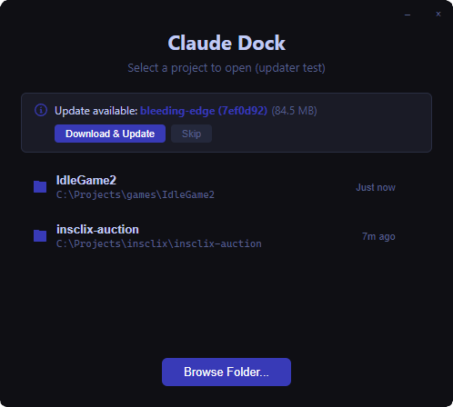

<h1 align="center">Claude Dock</h1>

<p align="center">
  
</p> 

<p align="center">
  A terminal dock for managing multiple Claude Code CLI instances side by side.
</p>

<p align="center">
  <strong>Download the latest stable release:</strong><br/>
  <a href="https://github.com/BenDol/Claude-Dock/releases/latest/download/Claude-Dock-Setup.exe">Windows</a> |
  <a href="https://github.com/BenDol/Claude-Dock/releases/latest/download/Claude-Dock.AppImage">Linux</a> |
  <a href="https://github.com/BenDol/Claude-Dock/releases/latest/download/Claude-Dock.dmg">macOS</a>
  <br/>
  <sub>
    Prefer the latest build? Grab the
    <a href="https://github.com/BenDol/Claude-Dock/releases/tag/bleeding-edge">bleeding-edge</a>
    release (generated on every commit, may be unstable).
  </sub>
  <br/>
  <sub>
    <em>The stable download links resolve to the newest <code>vX.Y.Z</code> release. If no
    stable release has been cut yet, use the bleeding-edge link above.</em>
  </sub>
</p>

---

Claude Dock is an Electron app that lets you run multiple [Claude Code](https://docs.anthropic.com/en/docs/claude-code) CLI sessions in a tiled grid layout. It handles PTY management, session persistence, and automatic resumption so you can close and reopen your workspace without losing context.

## Features

- **Multi-terminal grid** - Run multiple Claude Code instances in an auto-tiling or freeform grid layout
- **Session persistence** - Sessions are saved automatically and resumed when you reopen a project
- **Configurable grid** - Adjust columns, gap size, and switch between auto and freeform layout modes
- **Dark and light themes** - Full theme support including terminal color schemes
- **Customizable terminal** - Font family, font size, line height, cursor style, scrollback, and full 16-color palette
- **Serialized launches** - Claude instances are launched sequentially to prevent config file race conditions
- **Copy/paste support** - Ctrl+C/V, Ctrl+Shift+C/V, and right-click context menu
- **Auto-updater** - Checks GitHub releases on launch with configurable update profiles (latest, bleeding-edge, or a specific tag)
- **Claude CLI auto-install** - Detects if Claude Code CLI is missing and offers one-click installation via npm, with a manual install fallback
- **Window controls** - Custom frameless window with minimize, maximize, and close


## Setup

### Prerequisites

- [Node.js](https://nodejs.org/) 18+
- [Claude Code CLI](https://docs.anthropic.com/en/docs/claude-code) installed and authenticated
- Windows: Visual Studio Build Tools (for node-pty native compilation)

### Install

```bash
git clone https://github.com/BenDol/Claude-Dock.git
cd Claude-Dock
npm install
```

The `postinstall` script automatically patches node-pty build files for Windows compatibility.

### Development

```bash
npm run dev
```

### Build

```bash
# Windows
npm run package:win

# macOS
npm run package:mac

# Linux
npm run package:linux
```

Build output is in the `dist/` directory.

## CLI Usage

After launching Claude Dock once, the `claude-dock` command is automatically registered and available from any terminal (you may need to restart your terminal for PATH changes to take effect).

```bash
# Open a dock in the current directory
claude-dock

# Open a dock in a specific project directory
claude-dock /path/to/project
```

If Claude Dock is already running, the command opens a new dock window in the existing instance instead of launching a second process.

**How it works:**
- **Windows** — A `claude-dock.cmd` shim is created next to the app executable and its directory is added to the user `PATH` via the registry.
- **macOS / Linux** — A wrapper script is placed in the app's user data directory and symlinked to `/usr/local/bin/claude-dock`. If `/usr/local/bin` isn't writable, you can manually add the wrapper directory to your `PATH`.

## Plugins

Claude Dock has a plugin system that lets you extend the app with toolbar buttons, windows, IPC handlers, lifecycle event listeners, and per-project settings. Plugins are loaded from the user plugins directory:

| Platform | Directory |
|----------|-----------|
| Windows  | `%APPDATA%/claude-dock/plugins/` |
| macOS    | `~/Library/Application Support/claude-dock/plugins/` |
| Linux    | `~/.config/claude-dock/plugins/` |

A minimal plugin is three files: `plugin.json` (manifest), `main.js` (logic), and optionally `index.html` (window UI). Drop the folder in the plugins directory, restart the app, approve the consent dialog, and it loads.

See the **[Plugin Development Guide](docs/plugins.md)** for the full API reference, examples, and security model.

## Known Issues

- **Portable build does not support multiple dock instances on Windows** — The portable `.exe` cannot detect an already-running instance, so each launch starts a separate process. Use the NSIS installer build for full multi-instance support.

## License

MIT
